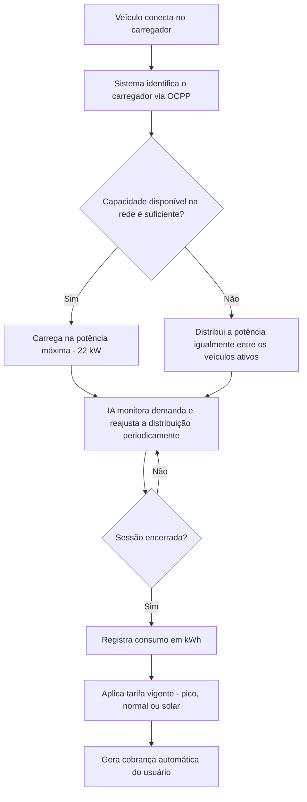

# ChargeGrid Intelligence - Sprint 2

Simulação do sistema de carregamento inteligente de veículos elétricos da GoodWe.

Disciplina: Pensamento Computacional e Automação com Python
Curso: Ciência da Computação - FIAP

---

## Integrantes

- David Gabriel Silva de Souza - RM: 574147
- Enzo Christino de Freitas - RM: 572037
- Filipe Gunther - RM: 571131
- Guilherme Guimarães - RM: 572957
- João Lucas - RM: 571355
- Lucas Pinheiro Barbosa - RM: 573497

---

## Sobre o projeto

Na Sprint 1 a gente fez a pesquisa sobre o ChargeGrid e identificou os principais problemas
(controle de demanda, padronização entre equipamentos, tarifação/cobrança e uso de IA).

Nessa Sprint 2 criamos uma **prova de conceito funcional** mostrando como o sistema
funcionaria na prática, evoluindo as soluções propostas na Sprint 1.

O dashboard simula:

- 6 carregadores com status em tempo real, todos operando via protocolo aberto **OCPP**
- Distribuição automática de carga entre os veículos conectados
- Tarifação dinâmica por horário (pico, normal e solar)
- Recomendações da IA com base na demanda atual
- Registro de consumo e cobrança por kWh

---

## Como rodar

Só baixar o arquivo `index.html` e abrir no navegador. Não precisa instalar nada.

---

## Arquitetura / Fluxo do sistema

O fluxo abaixo representa a lógica de decisão definida na Sprint 1 e implementada na
simulação:

Componentes da simulação:

- **Carregadores (C-01 a C-06):** representam as estações físicas, cada uma comunicando
  status, potência e consumo via OCPP.
- **Motor de distribuição de carga:** aplica a regra "capacidade suficiente -> potência
  máxima, senão -> divisão proporcional", conforme o algoritmo de decisão da Sprint 1.
- **Motor de tarifação:** define o preço por kWh de acordo com o horário simulado (pico,
  normal ou solar).
- **Módulo de IA:** analisa a demanda total e gera recomendações em tempo real para o
  operador do sistema.

---

## Interoperabilidade (OCPP)

Um dos problemas identificados na Sprint 1 foi a falta de padronização entre equipamentos
de fabricantes diferentes. Para resolver isso, todos os carregadores da simulação operam
sob o protocolo aberto **OCPP (Open Charge Point Protocol)**, exibido como selo em cada
carregador do dashboard. O OCPP é o padrão de mercado adotado por estações de recarga para
se comunicarem com sistemas centrais de gestão (CSMS), permitindo que equipamentos de
marcas diferentes sejam controlados pela mesma plataforma sem necessidade de adaptadores
proprietários.

---

## Tarifação dinâmica

| Período | Tarifa |
|---|---|
| Horário de pico (08h-10h / 18h-20h) | R$ 1,80 / kWh |
| Horário normal | R$ 1,20 / kWh |
| Energia solar (10h-16h) | R$ 0,90 / kWh |

---

## Fundamento técnico da simulação

Os valores usados na simulação não são arbitrários:

- **22 kW por veículo:** corresponde à potência máxima típica de carregadores AC
  trifásicos comerciais (Modo 3 / conector Tipo 2), amplamente usados em estacionamentos e
  ambientes corporativos.
- **120 kW de capacidade total:** representa uma instalação comercial de médio porte com
  até 6 pontos de recarga simultâneos.
- **Redução de capacidade no horário de pico (120 kW -> 80 kW):** simula a limitação de
  demanda imposta pela concessionária de energia em horários de maior consumo da rede,
  forçando o sistema a redistribuir a carga entre os veículos conectados.
- **Tarifas diferenciadas por horário:** refletem a lógica real de tarifação por postos
  horários (tarifa branca/horosazonal), em que o custo da energia varia conforme a demanda
  da rede ao longo do dia.

## Escala de tempo da simulação

Para tornar a simulação visualmente dinâmica, 1 ciclo de atualização (3 segundos na tela)
representa simbolicamente 1 hora de operação real do sistema. Dessa forma, o painel
percorre um dia inteiro (24 ciclos) em poucos minutos, permitindo observar a variação de
tarifas, consumo e recomendações da IA ao longo de um dia simulado.

---

## Como o sistema funciona

1. Usuário conecta o veículo e o carregador se anuncia ao sistema central via OCPP
2. Sistema verifica a capacidade disponível da rede
3. Se tiver capacidade suficiente, carrega na potência máxima (22 kW)
4. Se não tiver, divide a carga proporcionalmente entre os veículos ativos
5. A IA monitora a demanda e reajusta a distribuição continuamente
6. No fim da sessão, registra o consumo em kWh e gera a cobrança automaticamente,
   aplicando a tarifa vigente no momento

---

## Tecnologias

HTML, CSS e JavaScript puro.

---

## Links

- Vídeo (YouTube, não listado): https://youtu.be/LTTZF53wRCU
- Repositório GitHub: https://github.com/FilipeGMFanizzi/Sprint-02-Python.git
- Quadro Kanban (Trello): https://trello.com/b/SltlH7et/chargegrid-intelligence-sprint-2
